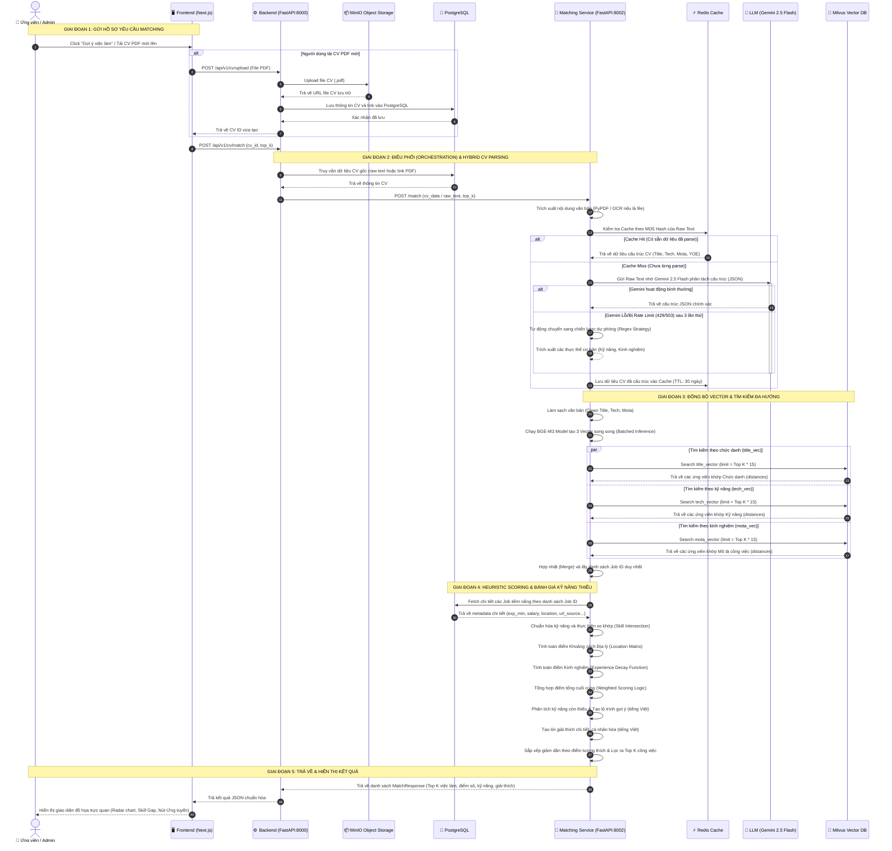

# Luồng Xử Lý Gợi Ý Việc Làm (CV-Job Matching Workflow)

Tài liệu này mô tả chi tiết quy trình xử lý gợi ý việc làm dựa trên độ tương thích của CV (CV-Job Matching) trong hệ thống **Career UTEHY NCKH**. Biểu đồ tuần tự dưới đây giúp làm rõ mối quan hệ, cách thức giao tiếp và trao đổi dữ liệu giữa các dịch vụ **Frontend (Next.js)**, **Backend (FastAPI)**, **Matching Service (FastAPI)** cùng các hạ tầng lưu trữ cơ sở dữ liệu (**PostgreSQL, Milvus, Redis, MinIO**).

---

## 1. Biểu Đồ Tuần Tự Hệ Thống (Sequence Diagram)

Dưới đây là sơ đồ tuần tự chi tiết mô tả luồng khớp hồ sơ từ lúc ứng viên thao tác trên giao diện cho đến khi nhận được kết quả phân tích độ tương thích và lộ trình cải thiện kỹ năng:



---

## 2. Chi Tiết Các Giai Đoạn Xử Lý Trong Luồng

Quy trình khớp dữ liệu được chia làm 5 giai đoạn chính được tối ưu hóa tối đa về hiệu năng và trải nghiệm người dùng:

### Giai đoạn 1: Khởi tạo Yêu cầu (Request Ingestion)
- **Hành động:** Ứng viên tải CV (PDF) lên hoặc sử dụng Hồ sơ trực tuyến (Online Profile) sẵn có và bấm "Tìm việc phù hợp".
- **Xử lý:** 
  - Nếu là file PDF, hệ thống lưu trữ bản sao vật lý trên **MinIO** và cập nhật metadata vào **PostgreSQL** để dễ quản lý.
  - Sau đó, Frontend gửi một HTTP POST request chứa `cv_id` đến cổng Backend chính (Port `8000`).

### Giai đoạn 2: Điều phối & Phân tích Hybrid CV (Orchestration & Parsing)
- **Gọi Matching Service:** Backend chuyển tiếp yêu cầu đến Matching Service (Port `8002`) qua REST API.
- **Chiến lược Hybrid CV Parsing:**
  - Hệ thống sử dụng một thuật toán bóc tách kết hợp để giảm thiểu tối đa chi phí gọi API ngoại vi và tối ưu độ trễ:
    1. **Redis Cache:** Tạo mã băm MD5 dựa trên nội dung text của CV. Nếu trùng khớp với lượt quét cũ, hệ thống lấy kết quả parse trực tiếp từ Redis trong **~10ms** (Không cần chạy lại LLM).
    2. **Primary (Gemini 2.5 Flash):** Nếu chưa có cache, gửi raw text đến mô hình Gemini để chuyển đổi dữ liệu không cấu trúc thành cấu trúc JSON chuẩn (chức danh, kỹ năng, số năm kinh nghiệm, vị trí địa lý). Áp dụng **Retry & Exponential Backoff** (thử lại 3 lần) nếu lỗi mạng.
    3. **Fallback (Regex):** Nếu Gemini gặp sự cố kéo dài, hệ thống tự động kích hoạt bộ bóc tách Regex nội bộ để trích xuất từ khóa thô, đảm bảo luồng dịch vụ không bao giờ bị gián đoạn.

### Giai đoạn 3: Tìm kiếm ngữ nghĩa đa vector (Multi-Vector Search)
- **Tạo Vector Embedding:** Text sau khi parse được làm sạch và đưa vào mô hình **BGE-M3**. Mô hình này sẽ tạo ra 3 vector độc lập: `title_vector` (Chức danh), `tech_vector` (Kỹ năng) và `mota_vector` (Kinh nghiệm/Mô tả công việc).
- **Truy vấn song song (Parallel Query):**
  - Sử dụng thư viện bất đồng bộ `asyncio.gather` để tìm kiếm đồng thời trên 3 trường chỉ mục vector trong **Milvus Vector DB** với giới hạn mở rộng (Top K * 15) nhằm tránh bỏ sót các ứng viên tiềm năng.
  - Các kết quả trả về từ 3 luồng tìm kiếm được hợp nhất (Merge) lại theo mã Job ID duy nhất.

### Giai đoạn 4: Đánh giá Heuristic & Xếp hạng tinh (Heuristic Scoring & Re-ranking)
Matching Service sử dụng các quy tắc heuristics thông minh kết hợp dữ liệu gốc trong PostgreSQL để chấm điểm:
- **Chuẩn hóa công nghệ:** Sử dụng thuật toán chuẩn hóa thông minh (loại bỏ ký tự đặc biệt, đồng bộ đuôi, giữ lại các ký hiệu lập trình đặc trưng như `C++`, `C#`, `.NET`) để tìm chính xác phần giao của kỹ năng ứng viên và kỹ năng yêu cầu của Job.
- **Chênh lệch Địa lý (Geographic Score):** Sử dụng ma trận khoảng cách giữa các thành phố lớn để chấm điểm vị trí (Ví dụ: Bạn ở Hà Nội ứng tuyển Job Hà Nội = 1.0, ứng tuyển Job Hưng Yên = 0.92, ứng tuyển Job TP.HCM = 0.18).
- **Suy giảm Kinh nghiệm (Experience Decay):** Nếu ứng viên đáp ứng đủ hoặc vượt số năm kinh nghiệm tối thiểu yêu cầu (`candidate_years >= exp_min`) -> Điểm kinh nghiệm = 1.0. Nếu thiếu, điểm số sẽ bị suy giảm dần với hệ số decay 0.15/năm.
- **Trọng số Điểm cuối cùng (Weighted Scoring Logic):**
  $$\text{Final Score} = W_{\text{title}} \cdot S_{\text{title}} + W_{\text{tech}} \cdot S_{\text{tech}} + W_{\text{mota}} \cdot S_{\text{mota}} + W_{\text{loc}} \cdot S_{\text{loc}} + W_{\text{exp}} \cdot S_{\text{exp}}$$
- **Giải thích & Gợi ý (Vietnamese Localization):** 
  - Tạo lời giải thích chi tiết bằng tiếng Việt cực kỳ tự nhiên, làm nổi bật điểm mạnh về kỹ năng, kinh nghiệm và tính thuận tiện địa lý của ứng viên đối với công việc.
  - Đưa ra lộ trình cải thiện (Skill Improvement Suggestions) bằng tiếng Việt cực kỳ chi tiết cho từng kỹ năng còn thiếu.

### Giải thích công thức chấm điểm của Matching Service
- Kết quả cuối cùng được xác định bằng cách cộng có trọng số 5 yếu tố:
  - `S_title`: điểm similarity giữa chức danh CV và title job.
  - `S_tech`: điểm similarity giữa kỹ năng CV và kỹ năng job.
  - `S_mota`: điểm similarity giữa mô tả kinh nghiệm CV và mô tả công việc.
  - `S_loc`: điểm vị trí, đánh giá sự phù hợp về địa lý.
  - `S_exp`: điểm kinh nghiệm, đánh giá mức độ đủ/thiếu so với yêu cầu của job.

Công thức tổng hợp:
```math
\text{Final Score} = W_{\text{title}} \cdot S_{\text{title}} + W_{\text{tech}} \cdot S_{\text{tech}} + W_{\text{mota}} \cdot S_{\text{mota}} + W_{\text{loc}} \cdot S_{\text{loc}} + W_{\text{exp}} \cdot S_{\text{exp}}
```
- Mỗi `S_*` nằm trong khoảng `[0,1]`.
- Mỗi `W_*` là trọng số phản ánh tầm quan trọng.
- Kết quả `Final Score` được chuẩn hoá về `[0,1]`, rồi nhân 100 để trả về phần trăm tương thích.

Ví dụ:
- `W_title=0.2`, `W_tech=0.4`, `W_mota=0.2`, `W_loc=0.1`, `W_exp=0.1`
- `S_title=0.8`, `S_tech=0.6`, `S_mota=0.7`, `S_loc=0.9`, `S_exp=1.0`
- `Final Score = 0.73` → 73% phù hợp

Tại sao cần công thức này:
- Milvus chỉ cho biết job nào có nội dung giống về ngữ nghĩa, nhưng chưa đủ để đánh giá tính phù hợp thực tế.
- Công thức bổ sung điểm vị trí và điểm kinh nghiệm, giúp loại bỏ những job không phù hợp ngay cả khi nội dung giống.
- Nó giúp kết quả gợi ý vừa chính xác hơn vừa dễ giải thích.

Lưu ý: khi Milvus trả về `distance` với metric COSINE, hệ thống cần chuyển sang similarity bằng `S = 1 - distance` trước khi tính.

### Giai đoạn 5: Trả về kết quả và Hiển thị (Result Presentation)
- Dữ liệu Top K công việc phù hợp nhất sau khi xếp hạng được Matching Service đóng gói và trả về Backend dưới dạng JSON chuẩn.
- Backend chuyển tiếp về Frontend để hiển thị cho ứng viên giao diện trực quan sinh động bao gồm:
  - **Điểm số tương thích dạng Phần trăm** nổi bật.
  - **Bản đồ khoảng trống kỹ năng (Skill Gap Analysis)** giúp ứng viên biết mình cần bổ sung gì.
  - **Nút hành động ứng tuyển ngay** kèm liên kết nguồn gốc công việc.
